# Clon de cartucho Driver-Test
## Descripción
Este es un programa, distribuido en cartucho diseñado expresamente para él, que se usó (se sigue usando?) en los centros psicotécnicos para renovar el carné de conducir.

Necesita un MSX-2 para funcionar. Probado en un Philips VG-8235. También probado en BlueMSX usando C-BIOS y emulando un MSX-2. En este caso, la ROM debe cargarse como ROM de 64KB. No usa ningún mapper externo.

Mi cartucho venía enterrado hasta la mitad en epoxy blanco, con lo que me era imposible trazar el esquema del circuito extra. Afortunadamente, encontré en internet fotos de otros cartuchos, algunos de ellos completamente "limpios". Gracias a dichas fotos pude terminar de sacar el esquema.

Créditos de estas fotos, a quien corresponda. No son mías.

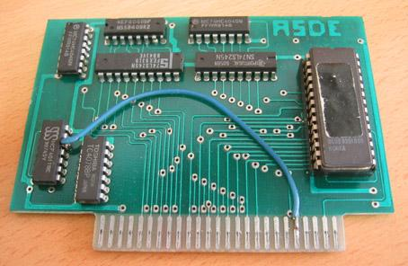

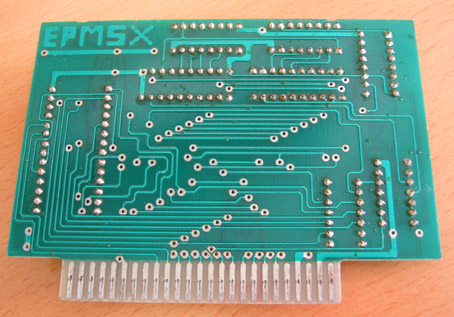

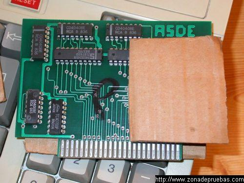

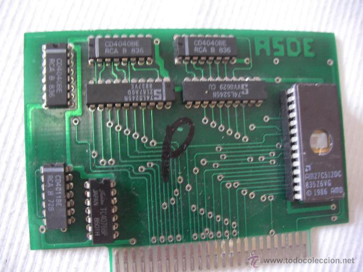

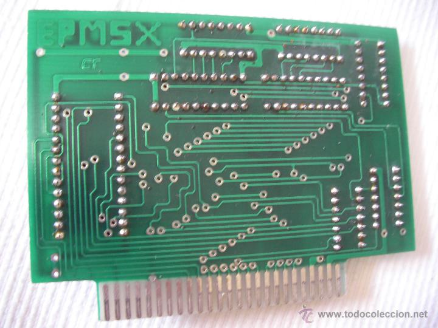

El cartucho original consta de una EPROM tipo 27512, de 64K x 8 bits, y circuitería extra que funciona según el esquema adjunto:
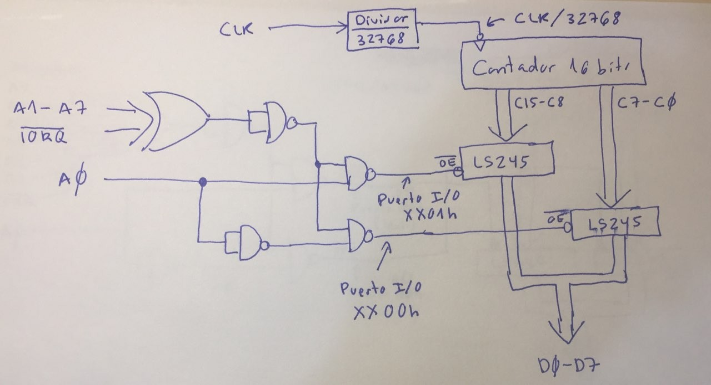
**NOTA:** tras sintetizar este circuito en la CPLD, me di cuenta de que el divisor no es entre 32768 (15 bits) sino entre 16384 (14 bits). En la CPLD esto ya está corregido.

El circuito extra del cartucho Driver-Test está implementado originalmente con chips discretos. Implementa un divisor de reloj, que toma la señal de reloj de 3.57 MHz del slot del MSX y la divide entre 16384, para obtener un reloj de aproximadamente 218 Hz. Este reloj se usa para incrementar un contador de 16 bits.

Los 8 bits bajos de este contador pueden examinarse leyendo el puerto de E/S xx00h (donde xx es cualquier valor). Los 8 bits altos se leen con el puerto de E/S xx01h.

El circuito en el cartucho no usa la señal /RD para distinguir entre un ciclo de lectura y uno de escritura, así que **hay que evitar hacer escrituras a estos puertos con el cartucho conectado**, o habrá colisión en el bus de datos entre el valor que la CPU pretende escribir y el valor que el cartucho está enviando.

## Montaje

Para hacer el clon de este cartucho, me he basado en un [kit estándar para hacer cartuchos de MSX](https://www.ebsoft.fr/shop/es/home/28-msx-cartridge-kit-16-64k.html). La placa diseñada se suelda encima de esta otra. En el directorio **placa** están los esquemáticos, layout, y gerbers para fabricarla. El fichero JED a grabar en la CPLD está en el directorio **cpld**, junto con el código en Verilog y el proyecto para ISE. El volcado de la ROM que hay que grabar en la flash EPROM está en el directorio **docs**.

Placa con la circuitería extra. Al fabricar la PCB, pedir que tenga un **grosor no mayor de 1mm** (en lugar del habitual de 1.6mm).
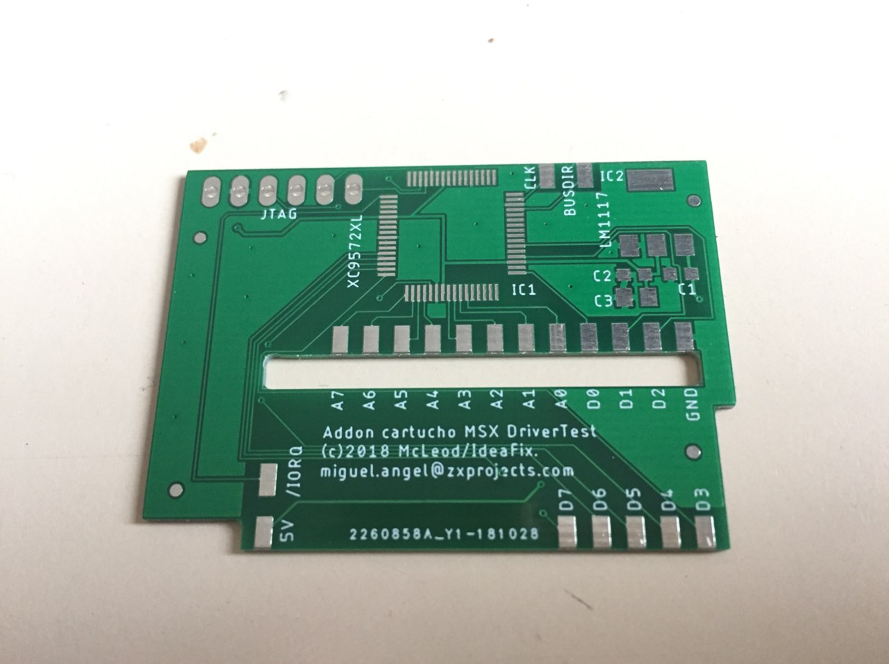

Placa presentada en el lugar donde será soldada en la PCB del cartucho principal.
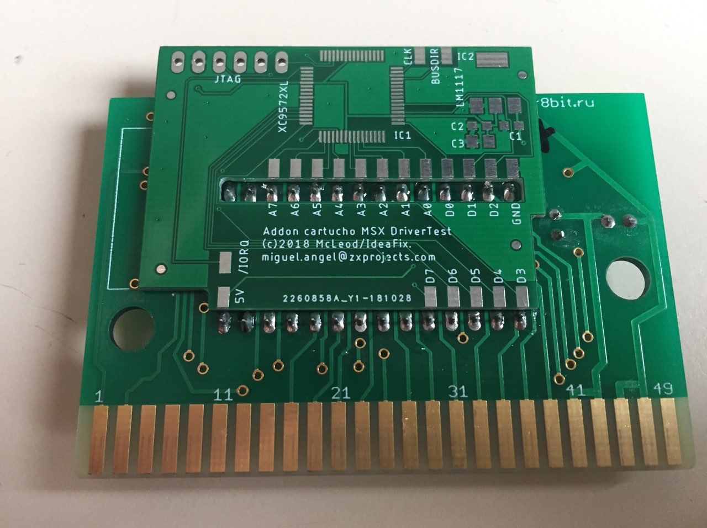

Placa completamente soldada. El cable que parece desaparecer por una via, va soldado al pad CLK del cartucho por el otro lado.
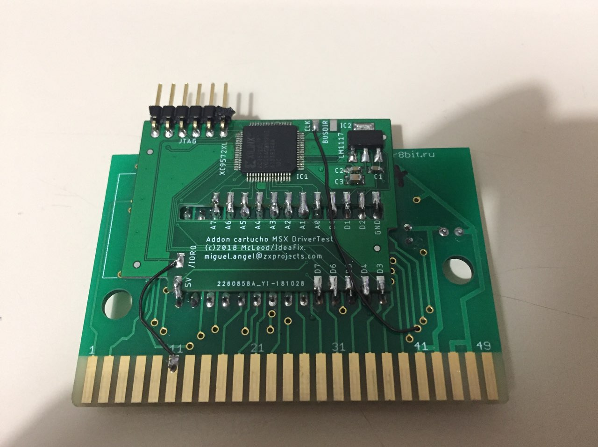

Detalle del cable que entra en la via para pasar al otro lado de la placa
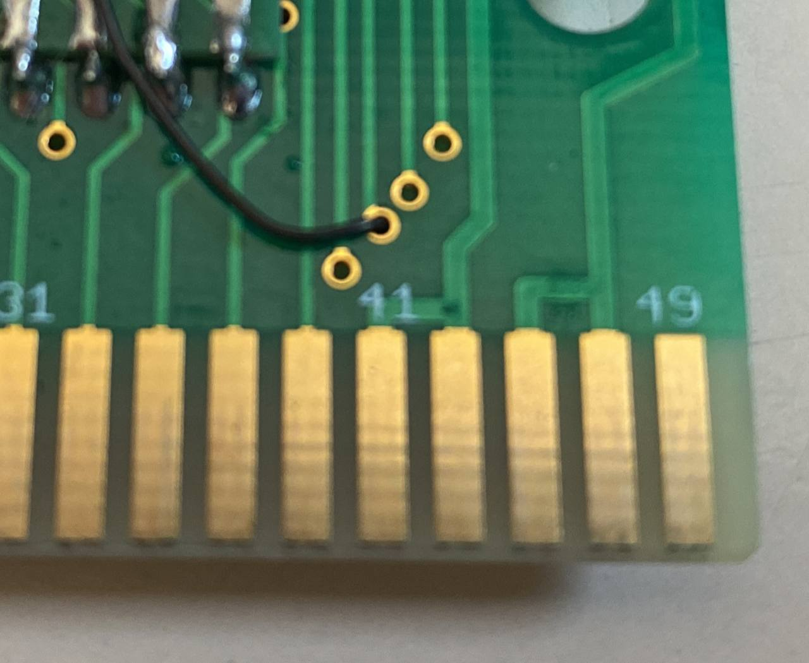

Detalle del cable ya soldado al pad CLK al otro lado de la placa
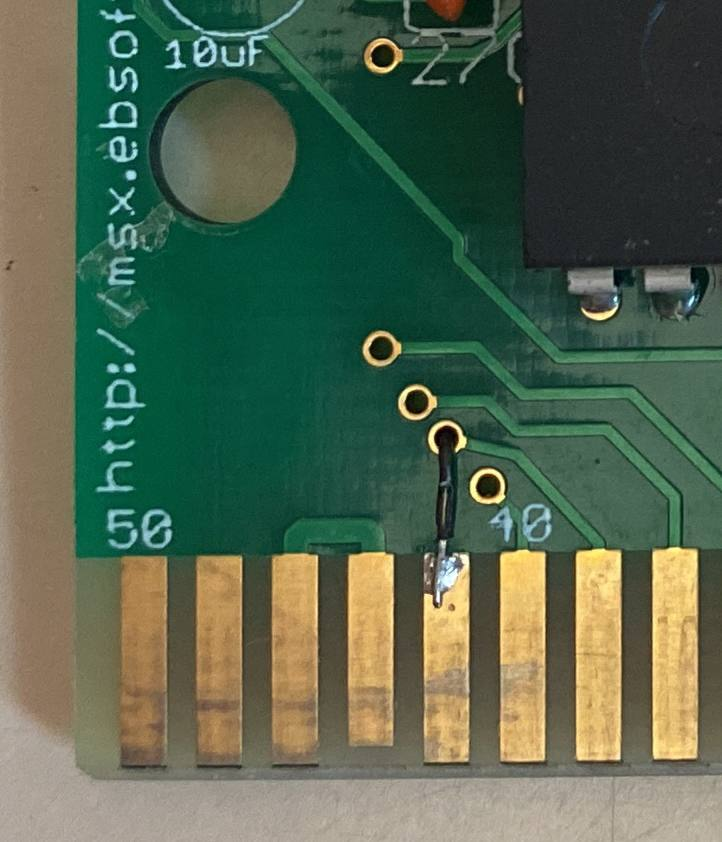

Aunque en la CPLD se genera, y hay un pad en la placa, he comprobado que la señal BUSDIR no es necesaria.

Cartucho cerrado y conectado a un Philips VG-8235
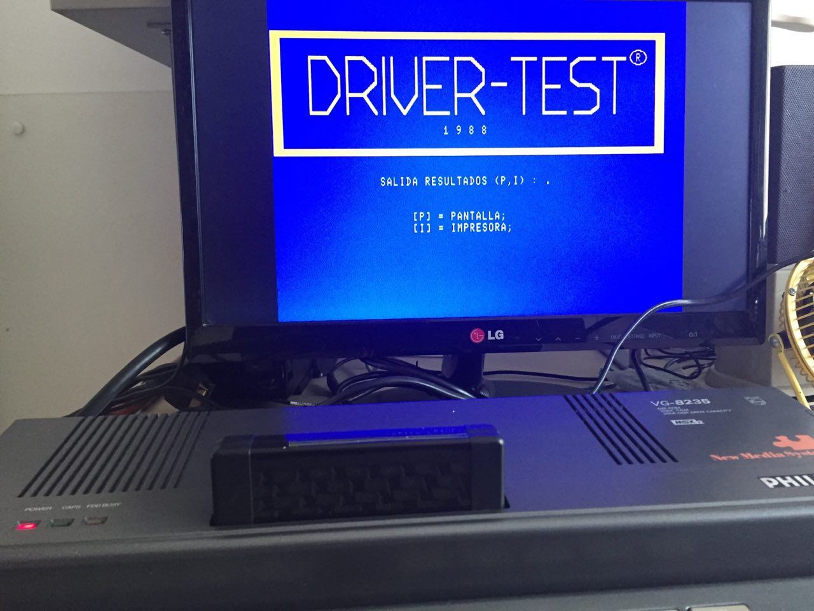

## Información extra

Esquema de la placa a soldar encima del cartucho
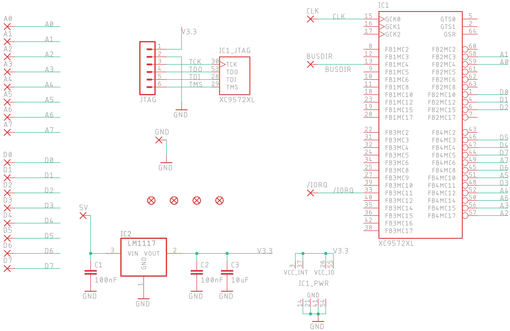

Imagen de rayos X de la PCB. La imagen es a tamño real, a 600ppp
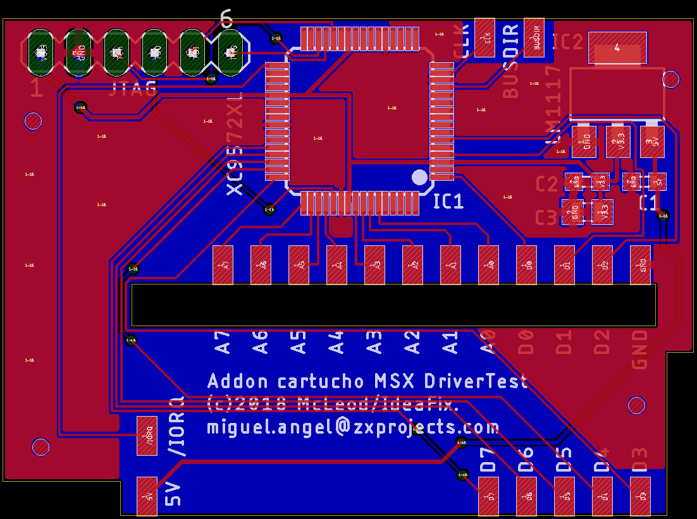

Layout de los componentes en la PCB. La imagen es a tamño real, a 600ppp
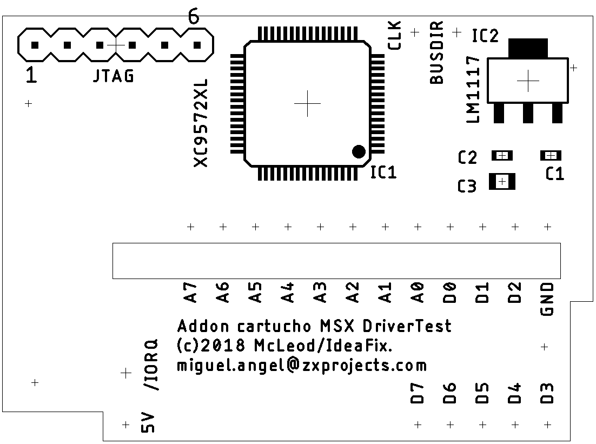
